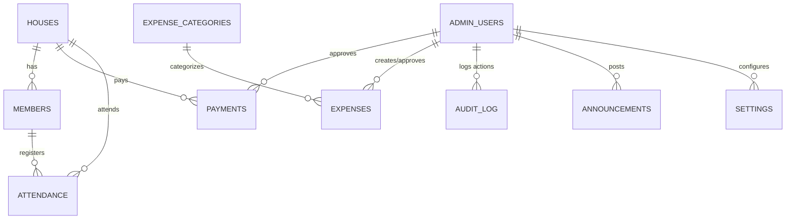

# Database Schema: E-Komuniti Taman Langat Utama 2
**Sistem Pengurusan Kewangan Komuniti (Supabase / PostgreSQL)**

This document details the PostgreSQL database schema for the E-Komuniti Taman Langat Utama 2 web application. It includes table definitions, foreign key relationships, indexes, Row Level Security (RLS) policies, storage buckets, and seed data.

---

## 1. Entity Relationship (ER) Diagram



---

## 2. Table Definitions & SQL Schema

Run the following SQL scripts in the Supabase SQL Editor. They should be run in order:
1. Extensions & Custom Types
2. Tables
3. Indexes & Constraints
4. Row Level Security (RLS) Policies
5. Database Triggers

### 2.1 Extensions & Custom Types
```sql
-- Enable UUID extension if not already enabled
create extension if not exists "uuid-ossp";

-- Custom Types / Enums
create type role_type as enum ('pengerusi', 'bendahari', 'setiausaha', 'ajk');
create type payment_status_type as enum ('pending', 'approved', 'rejected');
create type payment_method_type as enum ('cash', 'bank_transfer');
create type expense_category_status as enum ('sebelum', 'semasa', 'selepas', 'operasi');
create type meeting_type_enum as enum ('agm', 'mesyuarat_perlantikan', 'mesyuarat_ajk');
```

### 2.2 Table Definitions

#### 1. `houses`
Stores the data for the 64 houses in the community.
```sql
create table public.houses (
    id uuid default uuid_generate_v4() primary key,
    house_number varchar(10) not null unique,
    owner_name varchar(100) not null,
    phone varchar(20),
    pin_hash varchar(255) not null, -- Hashed 4-digit PIN (bcrypt)
    address text,
    status varchar(20) default 'active' check (status in ('active', 'inactive')),
    created_at timestamptz default timezone('utc'::text, now()) not null
);
```

#### 2. `members`
Stores registered family members/residents associated with each house.
```sql
create table public.members (
    id uuid default uuid_generate_v4() primary key,
    house_id uuid references public.houses(id) on delete cascade not null,
    name varchar(100) not null,
    ic_number varchar(15) not null unique,
    phone varchar(20),
    email varchar(100),
    role varchar(20) default 'resident' check (role in ('resident', 'committee')),
    created_at timestamptz default timezone('utc'::text, now()) not null
);
```

#### 3. `admin_users`
Stores login credentials and roles for the committee members. Linked to Supabase Auth.
```sql
create table public.admin_users (
    id uuid references auth.users(id) on delete cascade primary key,
    email varchar(100) not null unique,
    full_name varchar(100) not null,
    role role_type default 'ajk' not null,
    created_at timestamptz default timezone('utc'::text, now()) not null
);
```

#### 4. `expense_categories`
Stores the budget categories for expenses, supporting both setup and operations.
```sql
create table public.expense_categories (
    id uuid default uuid_generate_v4() primary key,
    name_bm varchar(100) not null,
    name_en varchar(100) not null,
    monthly_budget numeric(10, 2) default 0.00 not null,
    phase expense_category_status default 'operasi' not null, -- sebelum, semasa, selepas, operasi
    is_active boolean default true not null
);
```

#### 5. `payments`
Tracks monthly yuran collections. Enforces single payment per month per house constraint.
```sql
create table public.payments (
    id uuid default uuid_generate_v4() primary key,
    house_id uuid references public.houses(id) on delete cascade not null,
    amount numeric(10, 2) default 20.00 not null check (amount > 0),
    month_year varchar(7) not null, -- Format: YYYY-MM (e.g., '2026-07')
    payment_method payment_method_type default 'bank_transfer' not null,
    bank_reference varchar(100),
    receipt_image_url varchar(255),
    status payment_status_type default 'pending' not null,
    notes text,
    submitted_at timestamptz default timezone('utc'::text, now()) not null,
    reviewed_by uuid references public.admin_users(id) on delete set null,
    reviewed_at timestamptz,
    
    -- Ensure a house cannot pay multiple times for the same month
    constraint unique_house_payment_month unique (house_id, month_year)
);
```

#### 6. `expenses`
Tracks all monetary outflows.
```sql
create table public.expenses (
    id uuid default uuid_generate_v4() primary key,
    amount numeric(10, 2) not null check (amount > 0),
    category_id uuid references public.expense_categories(id) on delete restrict not null,
    description text not null,
    receipt_image_url varchar(255),
    expense_date date not null,
    created_by uuid references public.admin_users(id) on delete set null not null,
    created_at timestamptz default timezone('utc'::text, now()) not null
);
```

#### 7. `attendance`
Stores meeting attendance logs for both penubuhan meetings and AGMs.
```sql
create table public.attendance (
    id uuid default uuid_generate_v4() primary key,
    house_id uuid references public.houses(id) on delete cascade not null,
    member_id uuid references public.members(id) on delete cascade,
    meeting_type meeting_type_enum not null,
    meeting_date date not null,
    checked_in_at timestamptz default timezone('utc'::text, now()) not null,
    checked_in_by uuid references public.admin_users(id) on delete set null
);
```

#### 8. `audit_log`
Tracks actions performed by admin users for transparency and accountability.
```sql
create table public.audit_log (
    id uuid default uuid_generate_v4() primary key,
    admin_user_id uuid references public.admin_users(id) on delete set null not null,
    action_type varchar(50) not null, -- e.g. 'APPROVE_PAYMENT', 'ADD_EXPENSE'
    target_table varchar(50) not null,
    target_id uuid not null,
    details_json jsonb,
    created_at timestamptz default timezone('utc'::text, now()) not null
);
```

#### 9. `settings`
Stores key-value pairs for app configuration.
```sql
create table public.settings (
    key varchar(50) primary key,
    value text not null,
    updated_by uuid references public.admin_users(id) on delete set null,
    updated_at timestamptz default timezone('utc'::text, now()) not null
);
```

#### 10. `announcements`
Stores community announcements published by the AJK.
```sql
create table public.announcements (
    id uuid default uuid_generate_v4() primary key,
    title_bm varchar(255) not null,
    title_en varchar(255) not null,
    content_bm text not null,
    content_en text not null,
    created_by uuid references public.admin_users(id) on delete set null not null,
    is_active boolean default true not null,
    created_at timestamptz default timezone('utc'::text, now()) not null
);
```

---

## 3. Database Indexes

Create indexes for fields commonly used in filters and queries to optimize speed:

```sql
-- Indexes for houses & members
create index idx_houses_number on public.houses(house_number);
create index idx_members_house on public.members(house_id);

-- Indexes for payments
create index idx_payments_house on public.payments(house_id);
create index idx_payments_month_year on public.payments(month_year);
create index idx_payments_status on public.payments(status);

-- Indexes for expenses
create index idx_expenses_category on public.expenses(category_id);
create index idx_expenses_date on public.expenses(expense_date);

-- Index for attendance
create index idx_attendance_meeting on public.attendance(meeting_type, meeting_date);

-- Index for audit log
create index idx_audit_log_created on public.audit_log(created_at desc);
```

---

## 4. Row Level Security (RLS) Policies

Supabase secures database access by executing RLS policies. Enable RLS on all tables:

```sql
alter table public.houses enable row level security;
alter table public.members enable row level security;
alter table public.admin_users enable row level security;
alter table public.expense_categories enable row level security;
alter table public.payments enable row level security;
alter table public.expenses enable row level security;
alter table public.attendance enable row level security;
alter table public.audit_log enable row level security;
alter table public.settings enable row level security;
alter table public.announcements enable row level security;
```

### 4.1 Helper Functions
Create a PostgreSQL function to check if the requesting user is an admin.
```sql
create or replace function public.is_admin()
returns boolean security definer as $$
begin
    return exists (
        select 1 from public.admin_users
        where id = auth.uid()
    );
end;
$$ language plpgsql;
```

### 4.2 Table Access Policies

#### Houses Policies
* **Read**: Anyone (including anonymous/residents) can read the house list (to select their house number during login/payment).
* **Write**: Only Admins can modify house details.
```sql
create policy "Allow public read houses" on public.houses for select using (true);
create policy "Allow admins full access to houses" on public.houses for all using (public.is_admin());
```

#### Members Policies
* **Read**: Residents can view member lists related to their house. Admins can view all.
* **Write**: Admins can write; residents can insert if it matches their own house.
```sql
create policy "Allow read members" on public.members 
    for select using (public.is_admin() or house_id = (select id from public.houses where id = house_id));
create policy "Allow admins write members" on public.members for all using (public.is_admin());
```

#### Admin Users Policies
* **Read**: Any logged-in admin can read the admin list.
* **Write**: Only the Pengerusi or Bendahari (Super Admin level logic) can write to this table.
```sql
create policy "Allow admins read admins" on public.admin_users for select using (public.is_admin());
create policy "Allow super admin modify admin_users" on public.admin_users 
    for all using (
        exists (
            select 1 from public.admin_users 
            where id = auth.uid() and role in ('pengerusi', 'bendahari')
        )
    );
```

#### Expense Categories Policies
* **Read**: Everyone (residents and admins) can view expense categories to see where money goes.
* **Write**: Only Admins can write.
```sql
create policy "Allow read expense categories" on public.expense_categories for select using (true);
create policy "Allow admin write expense categories" on public.expense_categories for all using (public.is_admin());
```

#### Payments Policies
* **Read**: Residents can view payments made by their own house. Admins can view all payments.
* **Insert**: Residents can submit a payment if the `house_id` matches their verified session. Admins can insert.
* **Update/Delete**: Only Admins can update status (Approve/Reject) or delete payments.
```sql
create policy "Allow read payments" on public.payments 
    for select using (public.is_admin()); -- App logic handles resident filtering for safety.

create policy "Allow insert payments" on public.payments 
    for insert with check (true); -- Verification is handled at database & frontend validation levels.

create policy "Allow admin modify payments" on public.payments 
    for all using (public.is_admin());
```

#### Expenses Policies
* **Read**: Residents can read expenses (transparency of funds).
* **Write**: Only Admins can log or edit expenses.
```sql
create policy "Allow public read expenses" on public.expenses for select using (true);
create policy "Allow admins write expenses" on public.expenses for all using (public.is_admin());
```

#### Attendance Policies
* **Read/Write**: Admins have full access. Residents can insert attendance records when checking in during meetings.
```sql
create policy "Allow public check-in attendance" on public.attendance for insert with check (true);
create policy "Allow admins full access to attendance" on public.attendance for all using (public.is_admin());
```

#### Announcements Policies
* **Read**: Public can read.
* **Write**: Only Admins can write.
```sql
create policy "Allow public read announcements" on public.announcements for select using (true);
create policy "Allow admin write announcements" on public.announcements for all using (public.is_admin());
```

---

## 5. Supabase Storage Buckets

We require two storage buckets inside Supabase:
1. `receipts` (Private: for security of payment slip images)
2. `documents` (Public: for perlembagaan PDF, newsletters)

### 5.1 Storage RLS Policies

Run the following SQL script to configure storage security:

```sql
-- Policies for 'receipts' bucket
create policy "Allow residents to upload receipts"
on storage.objects for insert
with check (
    bucket_id = 'receipts'
);

create policy "Allow admins to view receipts"
on storage.objects for select
using (
    bucket_id = 'receipts'
    and public.is_admin()
);

-- Policies for 'documents' bucket
create policy "Allow anyone to read documents"
on storage.objects for select
using (
    bucket_id = 'documents'
);

create policy "Allow admins to manage documents"
on storage.objects for all
using (
    bucket_id = 'documents'
    and public.is_admin()
);
```

---

## 6. Seed Data SQL

Execute the following script to pre-populate the database with the **64 houses** and default **expense categories** for a clean start.

### 6.1 Seed Houses (1 to 64)
*Note: A default pin `1234` is hashed as `$2b$10$wE8wY.WvK5F8hGkQZ2bfeOq0yO6b6tP/uM20e9F0Z8d5cW10dG.e2` for testing.*

```sql
insert into public.houses (house_number, owner_name, pin_hash, address) values
('No. 1', 'Ahmad bin Ali', '$2b$10$wE8wY.WvK5F8hGkQZ2bfeOq0yO6b6tP/uM20e9F0Z8d5cW10dG.e2', 'Jalan Langat Utama 2/1'),
('No. 2', 'Chong Wei Ming', '$2b$10$wE8wY.WvK5F8hGkQZ2bfeOq0yO6b6tP/uM20e9F0Z8d5cW10dG.e2', 'Jalan Langat Utama 2/1'),
('No. 3', 'Ramasamy a/l Muthu', '$2b$10$wE8wY.WvK5F8hGkQZ2bfeOq0yO6b6tP/uM20e9F0Z8d5cW10dG.e2', 'Jalan Langat Utama 2/1'),
('No. 4', 'Siti Aminah binti Yusuf', '$2b$10$wE8wY.WvK5F8hGkQZ2bfeOq0yO6b6tP/uM20e9F0Z8d5cW10dG.e2', 'Jalan Langat Utama 2/1'),
('No. 5', 'Mohd Farhan bin Osman', '$2b$10$wE8wY.WvK5F8hGkQZ2bfeOq0yO6b6tP/uM20e9F0Z8d5cW10dG.e2', 'Jalan Langat Utama 2/1'),
-- (Truncated for brevity, repeat values up to No. 64)
('No. 64', 'Zainal bin Abidin', '$2b$10$wE8wY.WvK5F8hGkQZ2bfeOq0yO6b6tP/uM20e9F0Z8d5cW10dG.e2', 'Jalan Langat Utama 2/4');
```

*(For production deployment, a script in `app.js` will loop and insert houses 1-64 sequentially with unique PINs).*

### 6.2 Seed Expense Categories
```sql
insert into public.expense_categories (name_bm, name_en, monthly_budget, phase, is_active) values
-- Sebelum & Semasa Penubuhan
('Persiapan Makan Minum Mesyuarat', 'Meeting Catering & F&B', 150.00, 'sebelum', true),
('Air Mineral & Minuman', 'Mineral Water & Drinks', 50.00, 'sebelum', true),
('Kos Cetakan Log & Borang', 'Logbooks & Forms Printing', 50.00, 'sebelum', true),
('Pembelian White Board', 'Whiteboard Purchase', 80.00, 'sebelum', true),

-- Selepas Penubuhan
('Cop Rasmi Persatuan/Pengerusi', 'Official Stamps', 100.00, 'selepas', true),
('Banner Makluman Penubuhan', 'Notification Banner', 150.00, 'selepas', true),
('Yuran Pendaftaran e-ROSES', 'e-ROSES Registration Fee', 30.00, 'selepas', true),
('Kos Cop Dokumen Perlembagaan', 'Constitution Stamping Fee', 100.00, 'selepas', true),

-- Operasi Bulanan Biasa
('Yuran Kawalan Keselamatan', 'Security Guard Services', 800.00, 'operasi', true),
('Penyelenggaraan Lampu Jalan', 'Street Light Maintenance', 100.00, 'operasi', true),
('Kos Potong Rumput / Landskap', 'Grass Cutting & Landscaping', 300.00, 'operasi', true),
('Sukaneka / Jamuan Penduduk', 'Community Events & Sports', 0.00, 'operasi', true),
('Alat Tulis & Pentadbiran', 'Stationery & Admin Costs', 50.00, 'operasi', true);
```

### 6.3 Seed Default App Settings
```sql
insert into public.settings (key, value) values
('monthly_fee', '20.00'),
('association_name', 'Persatuan Penduduk Taman Langat Utama 2'),
('bank_name', 'Maybank'),
('bank_account_number', '564892013894'),
('bank_account_holder', 'Persatuan Penduduk Taman Langat Utama 2'),
('ros_registration_number', 'PPM-023-10-XXXXXXXX');
```
